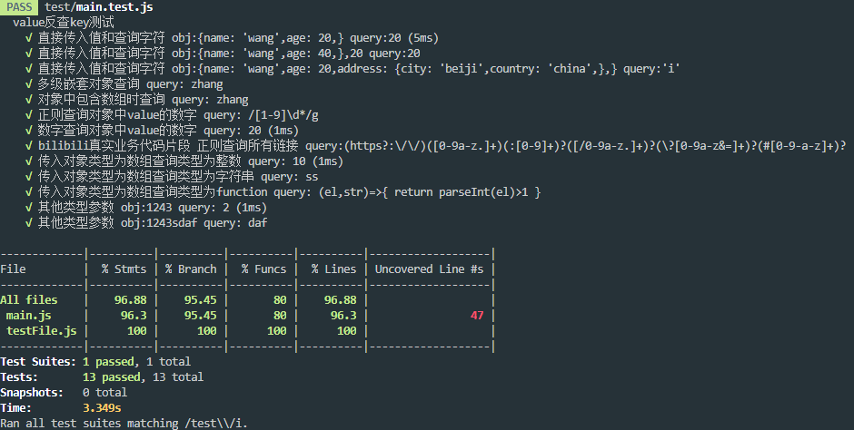

# 题设
假设我们现在有一个js的对象A，我们需要记录对象A自身属性的值中包含变量b的属性的出现位置，并已数组的形式返回,如果不包含直接返回[]：

现在需要您写一个 function，来实现这个功能。例如：
```js
// someFunction(目标对象，值)
someFunction(
{
name: 'wang',
age: 20,
},
20,
);
// return ['age']

someFunction(
{
name: 'wang',
age: 20,
},
40,
);
// return []


someFunction(
{
name: 'wang',
age: 20,
address: {
city: 'beiji',
country: 'china',
},
},
'i',
);
// return ['address.city','address.country']
```
最终实现源码
```js
/**
 *
 * @param {object|Array} obj 传入需要查询的对象,数组
 * @param {String|Number|RegExp|function} query 传入查询的字符,数字,正则,方法
 */
const valueFind2 = (obj, query) => {
  const [rearr, path] = [[], []];
  let count = 0;
  let fn = () => {};
  // 检测传入的query的类型 Number会被转化为String,reg则转化为reg.test方法,function则继承function
  typeof query === "function"
    ? (fn = query)
    : typeof query === "object"
    ? (fn = (element, query) => query.test(element + ""))
    : (fn = (element, string) => ("" + element).indexOf("" + string) >= 0);
  // 递归查询传递对象|数字
  const findvalue = (object, query) => {
    const obj = object;
    for (const key in obj) {
      if (obj.hasOwnProperty(key)) {
        const el = obj[key];
        if (typeof el === "object") {
          // 判断即将写入的路径是否在path的栈底
          path[0] === undefined
          // 在栈底且当传入的对象是一个数字
            ? Array.isArray(object)
              ? path.push("[" + key + "]")
              : path.push("" + key)
            : path.push("." + key); 
          findvalue(el, query);
          // 从递归出来后弹出栈顶路径
          path.pop();
        } else if (fn(el, query)) {
          Array.isArray(obj)
            ? // 当前类型为数组时,返回数组的下标
              (rearr[count] = path.join("") + "[" + key + "]")
            : // 当前类型为string || number 时,返回对象路径
              (rearr[count] =
                path.join("") + (path.length > 0 ? "." : "") + key);
          // 每寻找到一个符合条件的
          ++count;
        }
      }
    }
    return
  };
  findvalue(obj, query);
  return rearr;
};
module.exports = valueFind2;
```
ts版本在`src/main.ts`中,最先使用ts实现,随后编写为js
# 运行jest测试

`git clone https://github.com/moshuying/workSpace.git`

`npm install --registry https://registry.npm.taobao.org && npm run test`
jest运行结果

